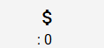

1.Player过关后给钱

A.Player过一小关之后的代码:

原:

```
  enterNextLevel(){
    // 结束游戏
    alert('本轮游戏结束，玩家胜利。进入下一轮游戏');

    // 挺进一小关
    this.littleRound++;
    // 小关: 只有1-3
    if(this.littleRound > 3){
      this.littleRound = 1;
      this.bigRound++;
    }
    // 部署地图上的敌方兵种
    for (let hexagon of this.hexagons) {
      hexagon.unit = null;
    }
    // 部署敌方兵种
    this.initAICamp(10,10);

    // 部署我方兵种(目前为默认部署,2骑兵)
    this.initPlayerCamp(10,10);
  }
```

现:

基于小关与大关修改playerMoney

```
this.playerMoney += (this.littleRound*100+this.bigRound*300);
```


2.将金钱显示在顶层栏中

顶层栏html:

原代码:

```html
<!-- 将领,顶层栏 -->
<div
    style="position: fixed; top: 0; left: 0; right: 0; background-color: #f4f4f4; border-bottom: 2px solid #ccc; padding: 4px;">
    <div style="display: flex; align-items: center; justify-content: center; gap: 10%;">
        <div *ngFor="let general of generals" style="text-align: center;">
            
            <div style="font-size: 12px; font-weight: bold;">
                {{ general.name }}
            </div>
            <div style="font-size: 20px; font-weight: bold; ">
                {{ general.skillDescription }}
            </div>
        </div>
    </div>   
</div>
```

现:

```
<!-- 将领,顶层栏 -->
<div
    style="position: fixed; top: 0; left: 0; right: 0; background-color: #f4f4f4; border-bottom: 2px solid #ccc; padding: 4px;">
    <div style="display: flex; align-items: center; justify-content: center; gap: 10%;">
        <div *ngFor="let general of generals" style="text-align: center;">
            
            <div style="font-size: 12px; font-weight: bold;">
                {{ general.name }}
            </div>
            <div style="font-size: 20px; font-weight: bold; ">
                {{ general.skillDescription }}
            </div>
        </div>
        <div> 玩家金钱: {{playerMoney}} </div>
    </div>   
</div>
```


3.修改金钱样式:

询问豆包:

Angular Material做一个钱的标志,旁边加上钱的数值

代码:

```
        <div style="display: flex; align-items: center;">
            <span>
                <mat-icon matPrefix>attach_money </mat-icon>
                <div>: {{playerMoney}}</div>
            </span>
        </div>
```

效果:

