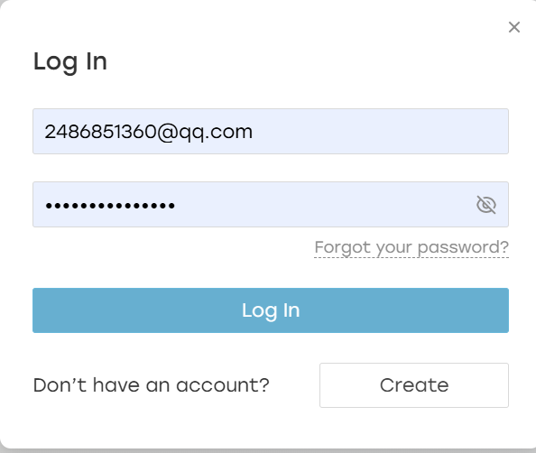

1.开发工具

Angular CLI: 16.0.1
Node: 16.16.0
Package Manager: npm 8.11.0
OS: win32 x64

2.期待效果:

3.默认账户:

u1=[username: lizeng, password: 123123]

u2=[username: weilianchen, password: 123123]

4.使用默认账户即可登录进入页面